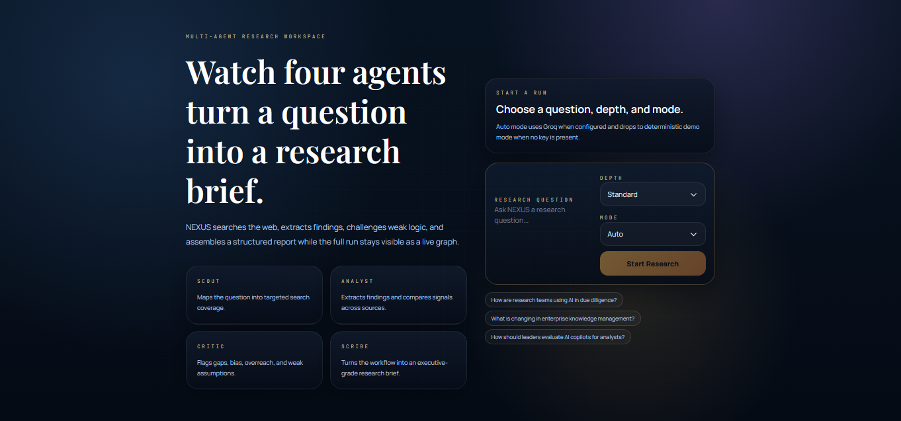
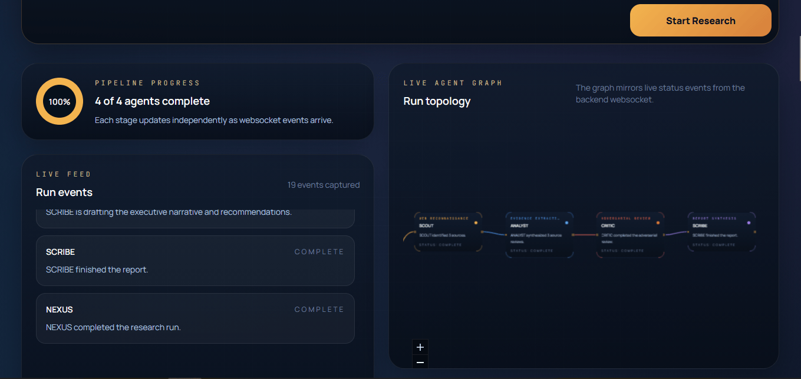
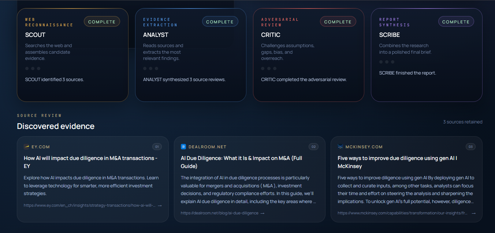
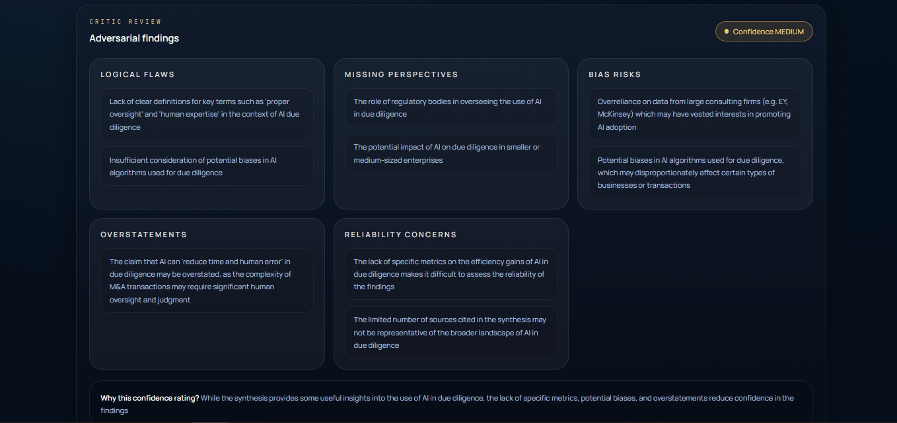
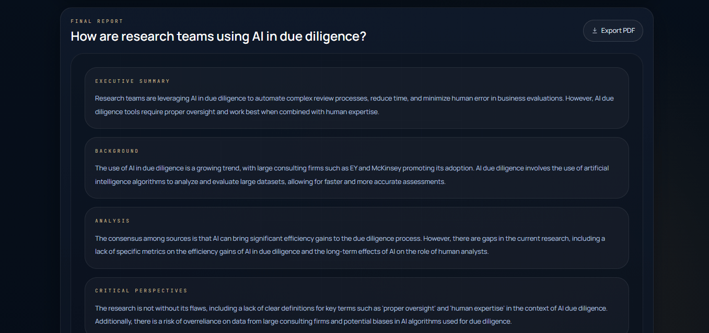
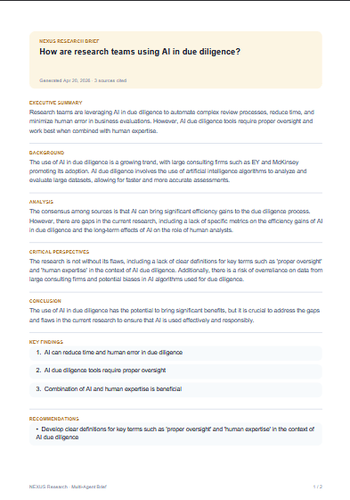

<div align="center">

# 🧠 NEXUS Research

### A Multi-Agent AI Research Workspace — Watch Four Agents Turn a Question Into a Structured Brief

[](https://www.python.org/)
[](https://fastapi.tiangolo.com/)
[](https://react.dev/)
[](https://vitejs.dev/)
[](https://tailwindcss.com/)
[](https://groq.com/)
[](LICENSE)

<br/>

> **NEXUS Research** is a full-stack multi-agent AI application that transforms a single research question into a structured executive brief. Four specialized agents — **SCOUT**, **ANALYST**, **CRITIC**, and **SCRIBE** — collaborate through a live pipeline powered by **Groq LLaMA 3.3 / 3.1** models, streaming their progress over WebSockets while rendering a real-time agent topology graph, source evidence, adversarial critique, and an exportable PDF report.

<br/>

  

</div>

---

## 📋 Table of Contents

- [Overview](#-overview)
- [Application Preview](#-application-preview)
- [Features](#-features)
- [Architecture](#-architecture)
- [Tech Stack](#-tech-stack)
- [Project Structure](#-project-structure)
- [Installation](#-installation)
- [Usage](#-usage)
- [The Four Agents](#-the-four-agents)
- [Token Optimization](#-token-optimization)
- [API Reference](#-api-reference)
- [Configuration](#-configuration)
- [Running Modes](#-running-modes)
- [Testing](#-testing)
- [Security Notes](#-security-notes)
- [Contributing](#-contributing)

---

## 🧠 Overview

NEXUS Research is a demonstration of how a small, transparent pipeline of specialized LLM agents can outperform a single monolithic prompt — and do it on a **Groq free-tier budget**. Instead of hiding reasoning behind one opaque call, NEXUS decomposes the research task into four visible stages and streams every intermediate state to the browser.

Users can:

- Enter a **plain-English research question**, pick a depth (*standard* / *deep*) and a mode (*auto* / *live* / *demo*)
- Watch a **live ReactFlow agent graph** animate as each agent takes over — powered by a FastAPI WebSocket
- See **sources, findings, synthesis, critique, and the final brief** populate the UI in real time
- Export the completed brief as a **branded, searchable PDF** with one click
- Run fully offline in **demo mode** (deterministic content, no API key required)

## License

This project is licensed under the MIT License. See [LICENSE](./LICENSE).

The backend is built with **FastAPI** and uses the **Groq Python SDK** against `llama-3.3-70b-versatile` and `llama-3.1-8b-instant`, with **DuckDuckGo** (`AsyncDDGS` + `httpx` HTML fallback) for web search and **BeautifulSoup** for page scraping. Every agent has its own model, temperature, and token cap — routed to keep a full run under a ~12k token budget on the free tier.

---

## 🖼️ Application Preview


<div align="center">

### Landing Page


### Live Agent Topology (Run in Progress)


### Agent Status Cards + Live Event Feed


### Discovered Sources & Critique Panel


### Final Research Report


### Exported PDF Brief


</div>

---

## ✨ Features

| Feature | Description |
|---|---|
| 🔎 **SCOUT Agent** | Expands a single question into 3–12 targeted search queries, then hits DuckDuckGo (async) and dedupes / de-ads the results |
| 📚 **ANALYST Agent** | Fetches each source, extracts the top findings with Groq, and synthesizes themes, consensus, conflicts, and knowledge gaps |
| 🧑‍⚖️ **CRITIC Agent** | Adversarially reviews the synthesis for logical flaws, missing perspectives, bias risk, overstatements, and reliability concerns |
| ✍️ **SCRIBE Agent** | Produces the final executive brief: summary, background, analysis, critical perspectives, key findings, recommendations, conclusion |
| 📡 **Live WebSocket Stream** | Normalized agent events (`running` / `searching` / `reading` / `complete` / `error`) push to the browser as they happen |
| 🌐 **ReactFlow Topology Graph** | Animated live pipeline visualization — edges flow when agents are active, colors match agent roles |
| 💾 **Semantic Prompt Cache** | Hash-based response cache keyed on `(prompt + model + schema)` — reused identical prompts cost zero tokens |
| 💸 **Per-Run Token Budget** | Hard guardrail (default **12k tokens/run**) stops the pipeline gracefully before the Groq free tier runs dry |
| 🎯 **Model Routing** | Cheap `llama-3.1-8b-instant` for SCOUT planning, `llama-3.3-70b-versatile` for ANALYST/CRITIC/SCRIBE |
| 🔁 **Graceful Fallback** | If DuckDuckGo rate-limits or scraping fails, SCOUT falls back to deterministic demo sources so the run never hangs |
| 📄 **Native PDF Export** | Text-based jsPDF export — selectable, searchable, and not broken by Tailwind v4 `oklch()` colors |
| 🧪 **Fully Tested** | Pytest on the backend, Vitest + Testing Library on the frontend, both green |

---

## 🏗️ Architecture

```
┌─────────────────────────────────────────────────────────────────────┐
│                       Browser / React 19 + Vite                     │
│                                                                     │
│  ┌────────────┐  ┌──────────────┐  ┌──────────────┐  ┌───────────┐  │
│  │ LandingPage│  │ AgentGraph   │  │ LiveFeed     │  │ Research  │  │
│  │ (Question +│  │ (ReactFlow — │  │ (WebSocket   │  │ Report +  │  │
│  │  Depth +   │  │  live edges  │  │  events feed)│  │ PDF Export│  │
│  │   Mode)    │  │  animated)   │  └──────┬───────┘  └─────┬─────┘  │
│  └─────┬──────┘  └──────┬───────┘         │                │        │
│        │ POST /research │   GET /research/:id    WS /ws    │        │
└────────┼────────────────┼─────────────────┼────────────────┼────────┘
         │                │                 │                │
┌────────▼────────────────▼─────────────────▼────────────────▼────────┐
│                       FastAPI Backend (main.py)                     │
│                                                                     │
│  ┌───────────────────────────────────────────────────────────────┐  │
│  │                    Agent Pipeline (sequential)                │  │
│  │                                                               │  │
│  │   SCOUT  ──►  ANALYST  ──►  CRITIC  ──►  SCRIBE               │  │
│  │   (plan +     (fetch +       (review +    (final brief)       │  │
│  │    search)     extract +      flag bias)                      │  │
│  │                synthesize)                                    │  │
│  └───────────────────────────────────────────────────────────────┘  │
│                                                                     │
│  ┌────────────────────┐  ┌─────────────────┐  ┌──────────────────┐  │
│  │  groq_service.py   │  │ search_service  │  │  scraper_service │  │
│  │  • model routing   │  │ • AsyncDDGS +   │  │  • httpx + bs4   │  │
│  │  • prompt cache    │  │   httpx fallback│  │  • concurrent    │  │
│  │  • token budget    │  │ • ad/redirect   │  │    fetch         │  │
│  │  • JSON retries    │  │   filter        │  │                  │  │
│  └────────────────────┘  └─────────────────┘  └──────────────────┘  │
│                                                                     │
│  ┌────────────────────┐  ┌─────────────────┐  ┌──────────────────┐  │
│  │  run_store.py      │  │ demo_service.py │  │  settings.py     │  │
│  │  In-memory run     │  │ Deterministic   │  │  env-driven      │  │
│  │  state + events    │  │ fallback path   │  │  config dataclass│  │
│  └────────────────────┘  └─────────────────┘  └──────────────────┘  │
└─────────────────────────────────────────────────────────────────────┘
                                │
                                ▼
                    ┌───────────────────────┐
                    │   Groq Cloud API      │
                    │ llama-3.3-70b + 3.1-8b│
                    └───────────────────────┘
```

---

## 🛠️ Tech Stack

| Layer | Technology |
|---|---|
| **Frontend** | React 19, Vite 8, Tailwind CSS 4, Framer Motion, `@xyflow/react`, Axios, jsPDF |
| **Backend** | FastAPI, Uvicorn, Pydantic 2, Python 3.11+ |
| **LLM Provider** | Groq Cloud — `llama-3.3-70b-versatile` (ANALYST / CRITIC / SCRIBE), `llama-3.1-8b-instant` (SCOUT) |
| **Web Search** | `duckduckgo-search` (`AsyncDDGS`) with `httpx` HTML fallback |
| **Scraping** | `httpx` + `BeautifulSoup4` |
| **Streaming** | Native FastAPI WebSockets with JSON-encoded `AgentEvent` broadcasts |
| **Testing** | Pytest (backend), Vitest + Testing Library (frontend) |
| **Export** | `jspdf` (native text PDF — no screenshot step, no `oklch()` issues) |

---

## 📁 Project Structure

```
nexus-research/
│
├── backend/
│   ├── main.py                     # FastAPI app — /research, /research/:id, /latest, /status, /ws
│   ├── requirements.txt            # Python deps
│   ├── .env                        # GROQ_API_KEY + token caps + model routing
│   │
│   ├── agents/
│   │   ├── scout.py                # Query planning + web search
│   │   ├── analyst.py              # Source reading + extraction + synthesis
│   │   ├── critic.py               # Adversarial review + confidence rating
│   │   └── scribe.py               # Final executive brief synthesis
│   │
│   ├── services/
│   │   ├── groq_service.py         # Groq SDK wrapper, prompt cache, token budget
│   │   ├── search_service.py       # AsyncDDGS + httpx fallback + ad filter
│   │   ├── scraper_service.py      # httpx + BeautifulSoup page fetcher
│   │   ├── demo_service.py         # Deterministic offline pipeline
│   │   ├── run_store.py            # In-memory run state + event log
│   │   └── settings.py             # Env-driven dataclass config
│   │
│   ├── models/
│   │   └── schemas.py              # Pydantic models — coercive validators for robust LLM JSON
│   │
│   └── tests/
│       └── test_api.py             # Pytest suite — demo-mode end-to-end
│
├── frontend/
│   ├── src/
│   │   ├── App.jsx                 # Root — landing ↔ research workspace
│   │   ├── main.jsx                # Vite entry
│   │   ├── pages/
│   │   │   ├── LandingPage.jsx     # Hero + preview cards + start form
│   │   │   └── ResearchPage.jsx    # Live workspace — graph, feed, sources, report
│   │   ├── components/
│   │   │   ├── AgentGraph.jsx      # ReactFlow topology with animated edges
│   │   │   ├── AgentCard.jsx       # Per-agent status card with live pulse
│   │   │   ├── LiveFeed.jsx        # Scrollable WebSocket event log
│   │   │   ├── ProgressRing.jsx    # Conic-gradient pipeline progress
│   │   │   ├── SearchBar.jsx       # Question + depth + mode form
│   │   │   ├── SourceCard.jsx      # Favicon + domain + snippet + numbered badge
│   │   │   ├── CritiquePanel.jsx   # Adversarial findings + confidence chip
│   │   │   ├── ResearchReport.jsx  # Final report sections
│   │   │   └── ExportButton.jsx    # Native jsPDF export
│   │   ├── hooks/
│   │   │   ├── useResearch.js      # Run lifecycle, polling, 404 recovery
│   │   │   └── useWebSocket.js     # Reconnecting WS client
│   │   ├── services/
│   │   │   ├── api.js              # Axios wrappers
│   │   │   └── agentMeta.js        # Agent colors, tones, status enums
│   │   └── styles/
│   │       └── globals.css         # Tailwind + custom panel / graph styles
│   ├── package.json
│   └── vite.config.js
│
├── sample_outputs/
│   └── sample_report.md            # Example completed research brief
│
├── docs/
│   └── screenshots/                # README preview images
│
├── DECISIONS.md                    # Architecture decisions + trade-offs
└── README.md
```

---

## 🚀 Installation

### Prerequisites
- **Python 3.11+**
- **Node.js 18+**
- A [Groq API key](https://console.groq.com/keys) *(free tier works great)* — optional if you only want demo mode

### 1. Clone the Repository
```bash
git clone https://github.com/your-username/nexus-research.git
cd nexus-research
```

### 2. Backend Setup
```bash
cd backend
python -m venv .venv

# Activate virtual environment
source .venv/bin/activate        # Linux / macOS
.venv\Scripts\Activate.ps1       # Windows PowerShell

pip install -r requirements.txt
```

### 3. Configure Environment Variables
Create a `.env` file inside `backend/`:

```bash
# Groq (optional — leave empty to force demo mode)
GROQ_API_KEY=your_groq_api_key_here

# Model routing (optional — these are the defaults)
GROQ_MODEL_SCOUT=llama-3.1-8b-instant
GROQ_MODEL_ANALYST=llama-3.3-70b-versatile
GROQ_MODEL_CRITIC=llama-3.3-70b-versatile
GROQ_MODEL_SCRIBE=llama-3.3-70b-versatile

# Token caps per agent call (optional — defaults shown)
NEXUS_TOKEN_CAP_SCOUT=320
NEXUS_TOKEN_CAP_ANALYST_EXTRACT=700
NEXUS_TOKEN_CAP_ANALYST_SYNTHESIS=600
NEXUS_TOKEN_CAP_CRITIC=600
NEXUS_TOKEN_CAP_SCRIBE=1000

# Per-run hard budget — pipeline stops gracefully if exceeded
NEXUS_TOKEN_BUDGET_PER_RUN=12000

# Search timeout (seconds)
NEXUS_SEARCH_TIMEOUT_SECONDS=12.0
```

### 4. Start the Backend
```bash
uvicorn main:app --reload --host 127.0.0.1 --port 8000
```
API runs at `http://localhost:8000` · Interactive docs at `http://localhost:8000/docs`

### 5. Frontend Setup
```bash
cd ../frontend
npm install
```

Create a `.env` file in `frontend/` (optional — these are the defaults):

```bash
VITE_API_URL=http://localhost:8000
VITE_WS_URL=ws://localhost:8000/ws
```

### 6. Start the Frontend
```bash
npm run dev
```
Frontend runs at `http://localhost:5173`

---

## 💻 Usage

### Starting a Research Run
1. Open the app at `http://localhost:5173`
2. Type a research question — e.g. *"How are research teams using AI in due diligence?"*
3. Choose a **Depth**: `standard` (3 sources) or `deep` (5 sources)
4. Choose a **Mode**:
   - **`auto`** — use Groq if the key is set, otherwise fall back to demo
   - **`live`** — require Groq (errors if no key)
   - **`demo`** — deterministic local content, no API calls
5. Click **Start Research**

### Watching the Pipeline
The research workspace shows everything that happens in real time:

- **Run topology graph** — animated ReactFlow edges flow between SCOUT → ANALYST → CRITIC → SCRIBE as each agent takes over
- **Progress ring** — conic gradient shows how many of the four agents are complete
- **Live feed** — every WebSocket event (`searching`, `reading`, `challenging`, `writing`, …) streams in
- **Agent cards** — per-agent status, current message, and live pulsing indicator

### Reading the Report
When SCRIBE finishes, three panels populate:

- **Discovered Evidence** — every source kept, with favicon, domain chip, snippet, and numbered badge
- **Critic Review** — adversarial findings grouped by category, with a color-coded confidence badge (`HIGH` / `MEDIUM` / `LOW`) and justification
- **Final Report** — Executive Summary, Background, Analysis, Critical Perspectives, Conclusion, Key Findings, Recommendations, Cited Sources

### Exporting as PDF
Click **Export PDF** at the top of the final report. NEXUS generates a **native text PDF** (selectable, searchable, branded with cover header and page footers) — no screenshot step, no color-parsing issues.

---

## 🤖 The Four Agents

| Agent | Role | Default Model | Output |
|---|---|---|---|
| 🟡 **SCOUT** | Web reconnaissance | `llama-3.1-8b-instant` | 3–12 search queries, deduped ranked sources |
| 🔵 **ANALYST** | Evidence extraction | `llama-3.3-70b-versatile` | Per-source findings + synthesis (themes, consensus, conflicts, gaps) |
| 🔴 **CRITIC** | Adversarial review | `llama-3.3-70b-versatile` | Logical flaws, missing perspectives, bias risk, overstatements, confidence rating |
| 🟣 **SCRIBE** | Report synthesis | `llama-3.3-70b-versatile` | Full executive brief: 5 prose sections + key findings + recommendations |

Each agent runs sequentially, emits structured WebSocket events (`running` → `working status` → `complete`), and pipes its output into the next agent's context.

---

## 💸 Token Optimization

NEXUS is engineered to run a full 4-agent pipeline **inside the Groq free-tier budget**. Key techniques applied in `groq_service.py` and `settings.py`:

| Technique | Impact |
|---|---|
| **Model routing** | SCOUT (planning) uses the cheap 8B model; heavy reasoning agents use 70B |
| **Strict per-agent `max_tokens`** | Hard caps stop verbose outputs before they bloat the next agent's prompt |
| **Low temperatures (0.1–0.3)** | Deterministic outputs = fewer retries |
| **Semantic prompt cache** | Hash `(normalized_prompt + model + schema)` — identical repeats cost 0 tokens |
| **Field pruning in prompts** | Only top-N findings pass to CRITIC / SCRIBE instead of the full set |
| **Per-run token budget** | `NEXUS_TOKEN_BUDGET_PER_RUN` — pipeline returns a partial report rather than failing hard |
| **JSON retry guardrail** | Smart retries on malformed JSON avoid silent token waste on invalid completions |

---

## 🔌 API Reference

| Method | Endpoint | Description |
|---|---|---|
| `POST` | `/research` | Create a new research run. Body: `{ question, depth, mode }` |
| `GET` | `/research/{run_id}` | Fetch current run status + result (if complete) |
| `GET` | `/latest` | Fetch the most recent completed run |
| `GET` | `/status` | API health + whether Groq is configured |
| `WS` | `/ws` | Stream normalized `AgentEvent` objects for all active runs |

**Example — start a run:**
```bash
curl -X POST http://localhost:8000/research \
  -H "Content-Type: application/json" \
  -d '{"question":"How are research teams using AI in due diligence?","depth":"standard","mode":"auto"}'
```

**Example `AgentEvent` broadcast:**
```json
{
  "run_id": "a1b2c3d4-...",
  "event": "agent_status",
  "agent": "SCOUT",
  "status": "searching",
  "message": "Running 4 search queries..."
}
```

---

## ⚙️ Configuration

### Backend (`backend/.env`)
```bash
GROQ_API_KEY=...                            # leave empty to force demo
GROQ_MODEL_SCOUT=llama-3.1-8b-instant
GROQ_MODEL_ANALYST=llama-3.3-70b-versatile
GROQ_MODEL_CRITIC=llama-3.3-70b-versatile
GROQ_MODEL_SCRIBE=llama-3.3-70b-versatile
NEXUS_TOKEN_CAP_SCOUT=320
NEXUS_TOKEN_CAP_ANALYST_EXTRACT=700
NEXUS_TOKEN_CAP_ANALYST_SYNTHESIS=600
NEXUS_TOKEN_CAP_CRITIC=600
NEXUS_TOKEN_CAP_SCRIBE=1000
NEXUS_TOKEN_BUDGET_PER_RUN=12000
NEXUS_SEARCH_TIMEOUT_SECONDS=12.0
CORS_ORIGINS=*                              # restrict in production
```

### Frontend (`frontend/.env`)
```bash
VITE_API_URL=http://localhost:8000
VITE_WS_URL=ws://localhost:8000/ws
```

---

## 🔄 Running Modes

| Mode | Behavior | When to use |
|---|---|---|
| **`auto`** | Use Groq if `GROQ_API_KEY` is set, otherwise fall back to `demo` | Default — safe for any environment |
| **`live`** | Require Groq. Errors out if no key is configured | Production / real research |
| **`demo`** | Deterministic offline content, no external calls | Screenshots, demos, CI, offline dev |

---

## 🧪 Testing

```bash
# Backend — Pytest
cd backend
pytest

# Frontend — Vitest (single run)
cd ../frontend
npm test -- --run

# Frontend — lint + production build
npm run lint
npm run build
```

---

## 🔒 Security Notes

> This project is built for **local development and demo deployments**. Before any public deployment:

- The backend defaults `CORS_ORIGINS=*` — restrict this to your actual frontend domain
- `run_store.py` is an in-memory dict — runs don't survive restarts and aren't safe for multi-tenant production use; swap in Redis or a database
- Never commit your `.env` or expose `GROQ_API_KEY` publicly
- The scraper follows redirects and fetches arbitrary URLs — consider adding a domain allowlist and hard timeouts in production (both are already in place as sane defaults)
- `demo` mode is a safe fallback that makes no external network calls

---

## 🤝 Contributing

1. Fork the repository
2. Create a feature branch: `git checkout -b feature/your-feature`
3. Commit your changes: `git commit -m 'Add your feature'`
4. Push: `git push origin feature/your-feature`
5. Open a Pull Request

**Ideas for improvement:** persistent run storage (Postgres/Redis), multi-turn follow-up questions, streaming Groq responses directly into the report UI, Docker compose for one-command setup, user authentication, per-user run history, alternative LLM providers (Cerebras, Together, Gemini), adaptive pipeline depth based on confidence, export to DOCX / Notion / Markdown, embedding-based semantic cache.

---

## License

This project is licensed under the MIT License. See [LICENSE](./LICENSE).

Made with ❤️ for anyone who's ever wanted to watch AI agents think out loud.

⭐ Star this repo if you find it useful!

</div>
